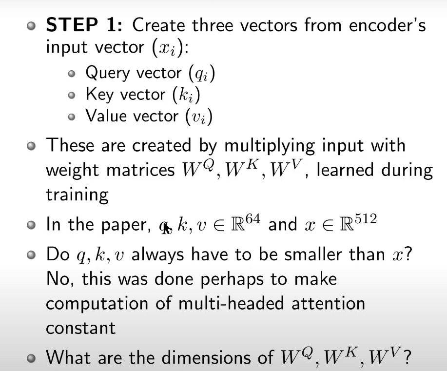

## Transformers : An Introduction 

Vibing with Sequential Data

### Motivation 

​						*First introduction to Transformers was presented in a paper named "Attention is All You Need", NeurIPS 17*

- This made possible to do Seq2Seq modeling without the use of RNNs

- Proposed transformer model, entirely built on self-attention mechanism

  without using sequence-aligned recurrent architectures

- Key  Components:

  	- Self-Attention
  	- Multi-Head Attention
  	- Positional Encoding
  	- Encoder-Decoder Architecture

Figure below illustrates how a machine translation task is done using a Transformer Network.

### Self Attention

Self-Attention allows the model to look at "What are the other words, that need to be paid attention to while you process one particular word".

*Reason it's called Self-Attention is*

Given a sequence when you are processing one element of that sequence, you make a **copy** of that sequence and see, which other parts of the **same** Sequence  are important to process this element. So as the model processes each word, self-attention allows is to look at other positions in input sequence to help get a better encoding.

Advantage of this approach over RNNs is that we now no longer need to maintain a hidden state to incorporate representation of previous words/vectors!

#### Working of Self-Attention

Suppose our input sequence have starting words **"Thinking"** and **"Machines"**. We would get text embedding/encoding of the words using some text processing methods, An embedding is a vector representation of the words in a sequence. Embeddings here are **X1** and **X2** respectively.

​								*First Step for the Self-Attention module is to create 3 vectors from the encoder's input vector (Xi)*

 

​										*Dimensions of the Weight Matrices (W) is from the above notion, (X) x (q,k,v) **[512x64]-***

So once you get your ***q, k** and **v*** vectors for each word in your input sequence, Step 2 in Self-Attention is to compute what are known as Self-Attention Scores, which is the score of all words of the input sentence against this particular word under consideration.

​																				***Length(k)*** here means the dimension of the vector *q,k and v*

 

Once this is done, the next step is to use Softmax to get a distribution of the attention of each of the words in the sequence with respect to the word under consideration. So once you get the scores you can perform a Softmax on them to get a weight for the first word, a weight for the second word with respect to the first word, we are still processing the first word here. Obviously here, the score of the first word w.r.t the first word, is likely to have the highest weight because you would expect that to process the first word, the first word is the most import word.

However we still have weight or attention vectors/values, over other words in the sequence, which also **add value** to processing the **current word**. Next we multiply the softmax output with the value vector ***(v)*** that we got earlier to get a **weighted representation** of the value vector respectively for every input in the sequence. We finally perform a weighted sum of all of these to get a weigthed sum.

 	

### Illustration of how the matrix multiplication is performed to form weighted representations

~~~python
class SelfAttention(nn.Module):
    def __init__(self, embed_size, heads) -> None:
        super(SelfAttention, self).__init__()
        self.embed_size = embed_size
        self.heads = heads
        self.head_dim = embed_size // heads # integer division
        
        #256 embedding size and want to divide into 

        assert (
            self.head_dim * heads == embed_size
        ), "Embedding size needs to be divisble by heads"

        # Mapping the inputs to required dimensions.
        self.values = nn.Linear(self.head_dim, self.head_dim, bias=False)
        self.keys = nn.Linear(self.head_dim, self.head_dim, bias=False)
        self.queries = nn.Linear(self.head_dim, self.head_dim, bias=False)
        self.fc_out = nn.Linear(heads * self.head_dim, embed_size)
        # Mapping out the same values but in the different heads of the transformer.

~~~

### Multi-Head Attention

Instead of using 1 ***Wk, Wq, Wv*** weight matrices, Transformers suggests to have multiple such weight matrices so to get multiple such Query, Key and Value vectors, so and you would do multiple *Self-Attention* computations and finally then concatenate and send them through a Linear Layer.

Improves performance of the attention layer in two ways:

- Expands model's ability to focus on different positions which could together enrich the processing of the current word. In example above, ***z1*** contains a bit of every other encoding, but dominated by actual word itself.
- Gives the attention layer a sense of multiple "*representation sub-spaces*" instead of choosing only one set of weight vectors and getting these different sub-spaces and processing these will get us better performance at the end; As after training, each set is used to project input embeddings into different representation sub-spaces.

​														 *Illustration below shows how the Multi-head attention module in the Encoder Network works.*

 ~~~python
     def forward(self, values, keys, query, mask):
         # Get number of training examples
         N = query.shape[0]
         # Variables dependent on the size of I/O sequences.
         # defining the variables in an abstract manner, always correspond to source and target sentence length.
         value_len, key_len, query_len = values.shape[1], keys.shape[1], query.shape[1]
         
 		# Starting of the Multi-Head attention module
         # Split the embedding into self.heads different pieces
         # splitting in self.heads and self.head_dim
 
         # Re-Mapping the embed size and splitting it for different heads as the input to Multi-Head Attention module.
         values = values.reshape(N, value_len, self.heads, self.head_dim) 
         keys =keys.reshape(N, key_len, self.heads, self.head_dim)
         query = query.reshape(N, query_len, self.heads, self.head_dim)
         
         # Passing through the linear layers after reshaping of V,Q and K
         values = self.values(values) # (N, value_len, heads, head_dim)
         keys = self.keys(keys) # '' 
         queries = self.queries(query) # ''
 
         # Einsum does matrix multiplication for query*keys for each training example
         # with every other training example, don't be confused be einsum
         # it's just how i like doing matrix multiplication @ bmm
 
         energy = torch.einsum("nqhd, nkhd->nhqk", [queries, keys])
         # queries shape: (N, query_len, heads, heads_dim),
         # keys shape: (N, key_len, heads, heads_dim)
         # On concatination along the heads_dim, shape will undergoes a change.
         # energy: (N, heads, query_len, key_len) // Resulting dimensions are defined as well
         # 
 
         # Mask padded indices so their weights become 0
         # if the element of the mask is 0, shut that off.
         # Replace the elements with float("-1e20"). (-ve infinity but for the numerical stability)
         if mask is not None:
             energy = energy.masked_fill(mask == 0, float("-1e20"))
 
         # Normalize energy values similarity to seq2seq + attention
         # so that they sum to 1. Also divide by scaling factor for 
         # better stability
         # Normalizing across the key_lenght "key_len"
         
         attention = torch.softmax(energy / (self.embed_size ** (1/2)), dim=3)
         
         # attention shape: (N, heads, query_len, key_len)
         # src = key_len, target length = query_len
         
 
         out = torch.einsum("nhql, nlhd->nqhd", [attention, values]).reshape(
             N, query_len, self.heads * self.head_dim
         )
         # einsum mapping -> "N,Heads,query_len,dimnesion", "N, value_len,heads,dimension "
 
         # Key_len and value_len are always going to be same, so multiplying across that dimension 
         # attention shape: (N, heads, query_len, key_len)
         # values shape: (N, value_len, heads ,heads_dim)
         # out after matrix multiply: (N, query_len, heads, heads_dim), then
         # we reshape and flatten the last two dimension
 
         out = self.fc_out(out)
         # Linear layer doesn't modify the shape, final shape will be 
         # (N, query_len, embed_size)
 
         return out
 
 ~~~

### Positional Encoding

Unlike RNN and CNN encoders, attention encoder outputs do not depend on order of inputs because you can choose to focus on what you want, irrespective of the order of the inputs. But **order** of sequence conveys import information for machine translation tasks and language modeling

The Idea: Add positional information of input token in the sequence into input embedding vectors, Given as a second input (positions) along with the input sequence (x).

Final input embeddings are concatenation of learnable embedding and positional encoding, So the role of Positional encoding is to bring some value of where in the sequence, a specific input which you are currently processing is.

 

~~~python

~~~

### Encoder 

The encoder is stack of 6 identical layers in this particular transformer that was proposed. Each layers has a multi-head self-attention layer and a simple position-wise fully connected feedforward network. Each sub-layer has a residual connection and layer-normalization; all sub-layers output data of same dimension D(model) = 512

So you first perform multi-head attention, Then the input also comes through a skip connection directly to the output of multi-head attention, there you add and normalize the ***(Z)*** output that you get out of multi-head attention, and ***(x + p)*** input that you get before the multi-head attention, you would add them, normalize them, that is fed into a feed-forward network. Once again adding and normalizing and that is the ouput of one encoder module. You would have six such encoder modules in this transformer architecture. All the sub-layers in this particular encoder layer, output data of the same dimension **512**.

~~~python
class TransformerBlock(nn.Module):
    def __init__(self, embed_size, heads, dropout, forward_expansion) -> None:
        super(TransformerBlock, self).__init__()
        self.attention = SelfAttention(embed_size, heads)
        self.norm1 = nn.LayerNorm(embed_size) # takes the avg. for every single example (more computation)
        self.norm2 = nn.LayerNorm(embed_size)

        self.feed_forward = nn.Sequential(
            nn.Linear(embed_size, forward_expansion * embed_size),
            nn.ReLU(),
            nn.Linear(forward_expansion * embed_size, embed_size),
        )

        self.dropout = nn.Dropout(dropout)

    def forward(self, value, key, query, mask):
        attention = self.attention(value, key, query, mask)

        # Add skip connection, run through normalization and finally dropout
        x = self.dropout(self.norm1(attention + query))
        forward = self.feed_forward(x)
        out = self.dropout(self.norm2(forward + x))
        return out
~~~

***Sticking things together to form the Complete Encoder Module*** [Taking Positional embedding and Input to the Module]

~~~python
class Encoder(nn.Module):
    def __init__(
        self,
        src_vocab_size,
        embed_size,
        num_layers,
        heads,
        device,
        forward_expansion,
        dropout,
        max_lenght,
    ):
        super(Encoder, self).__init__()
        self.embed_size = embed_size
        self.device = device
        self.word_embedding = nn.Embedding(src_vocab_size, embed_size)
        self.positional_embedding = nn.Embedding(max_lenght, embed_size)

        self.layers = nn.ModuleList(
            [
                TransformerBlock(
                    embed_size,
                    heads,
                    dropout=dropout,
                    forward_expansion=forward_expansion,
                )
                for _ in range(num_layers)
            ]
        )

        self.dropout = nn.Dropout(dropout)
    
    def forward(self, x, mask):
        N, seq_length = x.shape
        positions = torch.arange(0, seq_length).expand(N, seq_length).to(self.device)
        out = self.dropout(
            (self.word_embedding(x) + self.positional_embedding(positions))
        )

        # In the Encoder the query, key, value are all gonna be the same, it's in the
        # decoder this will change. This might look a bit odd in this case.
        for layer in self.layers:
            out = layer(out, out, out, mask)
        
        return out
~~~

### Decoder

Similarly, the decoder also had six identical layers. Each layer, again has multi-head attention and a feed-forward network. Again , you have a residual connection and a normalization step that is done before the output of the multi-head attention is given to the feed-forward layer. There is only one key difference here, there is a Initial Step also performs what is known as Masked-Multi-Head Attention, goal here is to not let the architecture see further words in the output sequence when it's processing one specific word.

- Each layer has 2 sub-layers of multi-head attention mechanism and 1 sub-layer of FC Network.
- First multi-head attention sub-layer is modified to prevent positions from attending to subsequent positions, as we don't want to look into future of target sequence when predicting current position

~~~python
class DecoderBlock(nn.Module):
    def __init__(self, embed_size, heads, forward_expansion, dropout, device) -> None:
        super(DecoderBlock, self).__init__()
        self.norm = nn.LayerNorm(embed_size)
        self.attention = SelfAttention(embed_size, heads=heads)
        self.transformer_block = TransformerBlock(
            embed_size, heads, dropout, forward_expansion
        )
        self. dropout = nn.Dropout(dropout)

    def forward(self, x, value, key, src_mask, trg_mask): 
        # src_mask is for the padded embeddings for the masked-attention head
        attention = self.attention(x, x, x, trg_mask)
        query = self.dropout(self.norm(attention + x))
        out = self.transformer_block(value, key, query, src_mask)
        return out
~~~

***Completing the Decoder Module*** 

~~~python
class Decoder(nn.Module):
    def __init__(
        self,
        trg_vocab_size,
        embed_size,
        num_layers,
        heads,
        forward_expansion,
        dropout,
        device,
        max_lenght,
    ) -> None:
        super(Decoder, self).__init__()
        self.device = device
        self.word_embedding = nn.Embedding(trg_vocab_size, embed_size)
        self.position_embedding = nn.Embedding(max_lenght, embed_size)

        self.layers = nn.ModuleList(
            [
                DecoderBlock(embed_size, heads, forward_expansion, dropout, device)
                for _ in range(num_layers)
            ]
        )
        self.fc_out = nn.Linear(embed_size, trg_vocab_size)
        self.dropout = nn.Dropout(dropout)
    
    def forward(self, x, enc_out, src_mask, trg_mask):
        N, seq_lenght = x.shape
        positions = torch.arange(0, seq_lenght).expand(N, seq_lenght).to(self.device)
        x = self.dropout((self.word_embedding(x) + self.position_embedding(positions)))

        for layer in self.layers:
            x = layer(x, enc_out, enc_out, src_mask, trg_mask)

        out = self.fc_out(x)

        return out

~~~

### Complete Architecture : Transformers

Scaled Dot Product attention can also be visualized as, Where you have Q, K an V, you first perform a matrix multiplication of Q and K that gives you your dot product -> then you scale the dot product -> then you may choose to mask it optionally (which is only done for the first decoder module) -> then you apply the *SoftMax* -> then multiplied with V and that becomes the output of the Scaled Dot Product Attention Module.

#### Putting things together to form the transformer module 

~~~python
class Transformer(nn.Module):
    def __init__(
        self,
        src_vocab_size,
        trg_vocab_size,
        src_pad_idx,
        trg_pad_idx,
        embed_size=512,
        num_layers=6,
        forward_expansion=4,
        heads=8,
        dropout=0,
        device="cpu",
        max_lenght=100,
    ) -> None:
        super(Transformer, self).__init__()

        self.encoder = Encoder(
            src_vocab_size,
            embed_size,
            num_layers,
            heads,
            device,
            forward_expansion,
            dropout,
            max_lenght,
        )

        self.decoder = Decoder(
            trg_vocab_size,
            embed_size,
            num_layers,
            heads,
            forward_expansion,
            dropout,
            device,
            max_lenght,
        )

        self.src_pad_idx = src_pad_idx
        self.tfg_pad_idx = trg_pad_idx
        self.device = device

    def make_src_mask(self, src):
        src_mask = (src != self.src_pad_idx).unsqueeze(1).unsqueeze(2)
        # (N, 1, 1, src_len)
        return src_mask.to(self.device)

    def make_trg_mask(self, trg):
        N, trg_len = trg.shape
        # torch.tril is used to do a triangular matrix (Triangular-Lower)
        trg_mask = torch.tril(torch.ones((trg_len, trg_len))).expand( 
            N, 1, trg_len, trg_len
        )

        return trg_mask.to(self.device)

    def forward(self, src, trg):
        src_mask = self.make_src_mask(src)
        trg_mask = self.make_trg_mask(trg)
        enc_src = self.encoder(src, src_mask)
        out = self.decoder(trg, enc_src, src_mask, trg_mask)
        return out

~~~

#### Small Example 

~~~python
if __name__ == "__main__":
    device = torch.device("cuda" if torch.cuda.is_available() else "cpu")
    print(device)

    # 1 --> start token, 0 --> padding, 2 --> end of sentence.
    x = torch.tensor([[1, 5, 6, 4, 3, 9, 5, 2, 0], [1, 8, 7, 3, 4, 5, 6, 7, 2]]).to(
        device
    )
    trg = torch.tensor([[1, 7, 4, 3, 5, 9, 2, 0], [1, 5, 6, 2, 4, 7, 6, 2]]).to(device)

    src_pad_idx = 0
    trg_pad_idx = 0
    src_vocab_size = 10 
    trg_vocab_size = 10
    model = Transformer(src_vocab_size, trg_vocab_size, src_pad_idx, trg_pad_idx, device=device).to(device)
    out = model(x, trg[:, :-1]) # Shift by one token to able to predict the end of sentence.
    print(out.shape)
~~~

**Output**: `torch.Size([2, 7, 10])` 

